# **Z line analysis**

This tutorial provides simple instructions on performing a new analysis with MyoProfiler. Clicking on any of the images on this page will open a larger version in a new browser window. The preparation shown here was probed for a Z line associated protein and a M line associated protein. The analysis and the tutorial focuses on the Z lines.

## Getting started

+ Using the MyoProfiler through MATLAB:
    - Launch MATLAB and navigate to the Apps tab on the top menu. Find the MyoProfiler under My Apps and start the application by clicking it. The instructions on how to locate the Apps tab can be found [here](../../installation/installing_matlab_app/installing_matlab_app.html).

+ Using the MyoProfiler as a stand-alone application:
    - Locate your `MyoProfiler.exe` shortcut and start the application by double-clicking it.

After a few seconds, you should see the program window, given below. 

<a href="media/myofibril_profiler_app.png" target="_blank">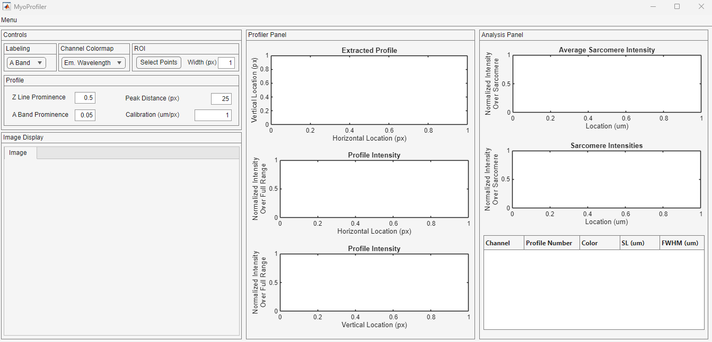</a>

Hover over to the Labeling panel and click on the dropdown menu, shown in red rectangle. Select the Z line option. 

<a href="media/labeling_drop_down.png" target="_blank">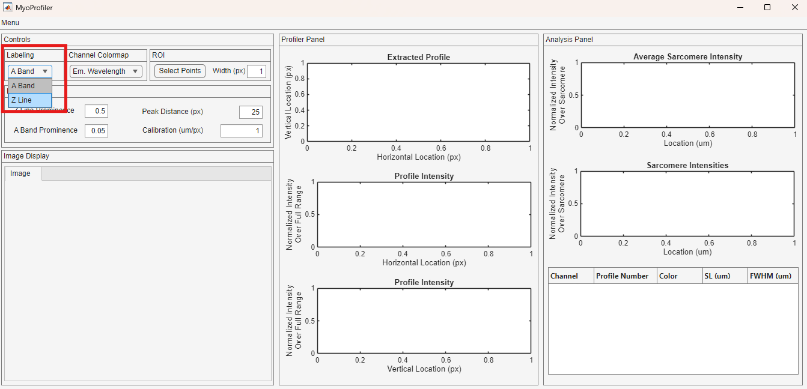</a>

Please note that the Z line interface is slightly different than the A band.

<a href="media/z_line_interface.png" target="_blank">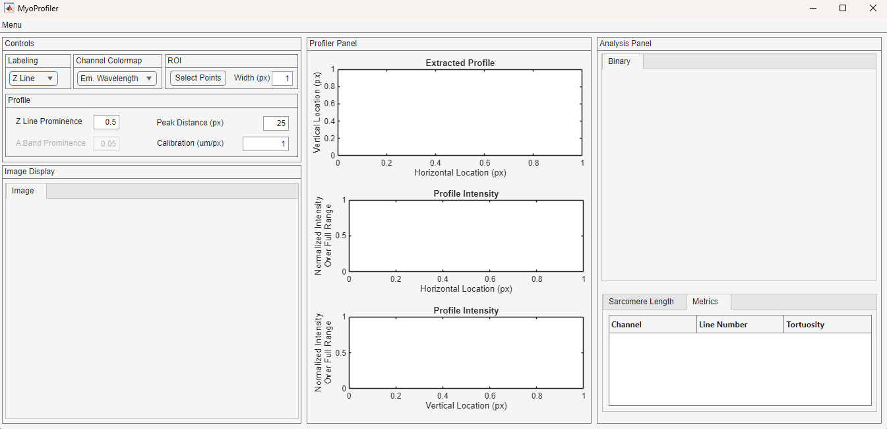</a>

## User panels

The interface is divided into multiple panels:

- Controls: The user controls are accessed in this panel:
    + Channel Colormap: Users can either use the emission wavelengths of each channel or [a generic colormap](https://en.wikipedia.org/wiki/Parula) for pseudo coloring and trace colors.
    + ROI: The regions of interest (ROI) is selected through this panel. By default, the ROIs are derived from splines, but users can expand them into quadrilaterals to average around the spline.
    + Profile: The software uses a [peak finding algorithm](https://www.mathworks.com/help/signal/ref/findpeaks.html) to identify the crescents and troughs in the profile. Users can change the default values through this panel. More detail on these options can be found below.
- Image Display: Loaded images are displayed in this panel. Channel tabs and an additional tab for the merged image is automatically generated.
- Profiler Panel: Extracted profiles are shown in this panel. Since the profiles are two-dimensional, there are additional displays for "views" from horizontal and vertical image axes.
- Analysis Panel: Binarized images and extracted metrics are shown in this panel. In addition to the sarcomere length, tortuosity is calculated and tabulated.

## Loading images

Users start their analysis by loading their images to the software environment. They can either use the commercial image formats, such as Nikon originated ".ND2" files, or standard image formats, for instance ".TIF" or ".PNG" files.

The MyoProfiler is built to support Nikon images. The image support will be extended in the future and the tutorial will be updated as needed.

### Loading Nikon .ND2 images

The Load Image option is located under the Menu on the top left corner, shown in the red rectangle. Click on the Menu and access to the dropdown menu.

<a href="media/top_menu_option.png" target="_blank">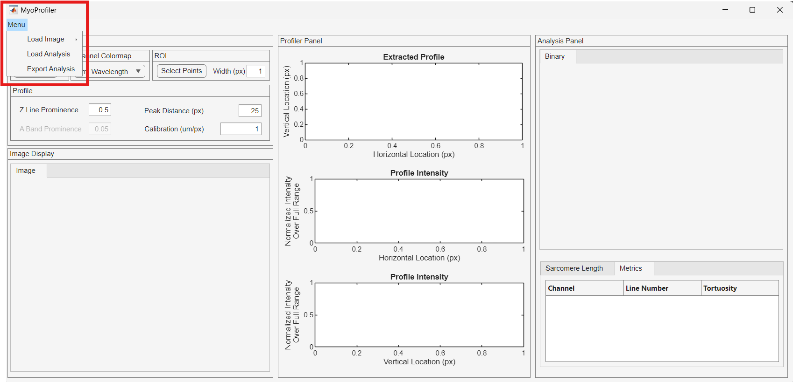</a>

As you hover over the Load Image option, additional options appear. Click on the Nikon option, highlighted in the red rectangle.

<a href="media/load_image_nikon.png" target="_blank">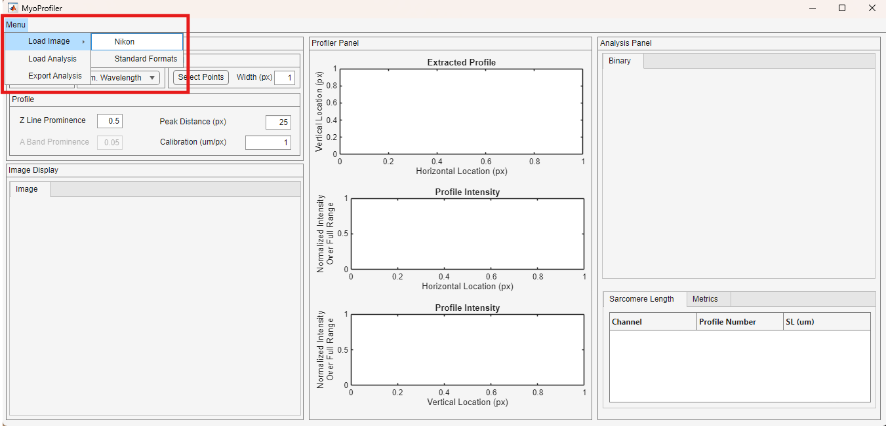</a>

The Nikon option opens the below file dialog. The dialog automatically looks for the .ND2 files. Navigate to your folder with the image files and click Open.

<a href="media/nikon_file_dialog.png" target="_blank">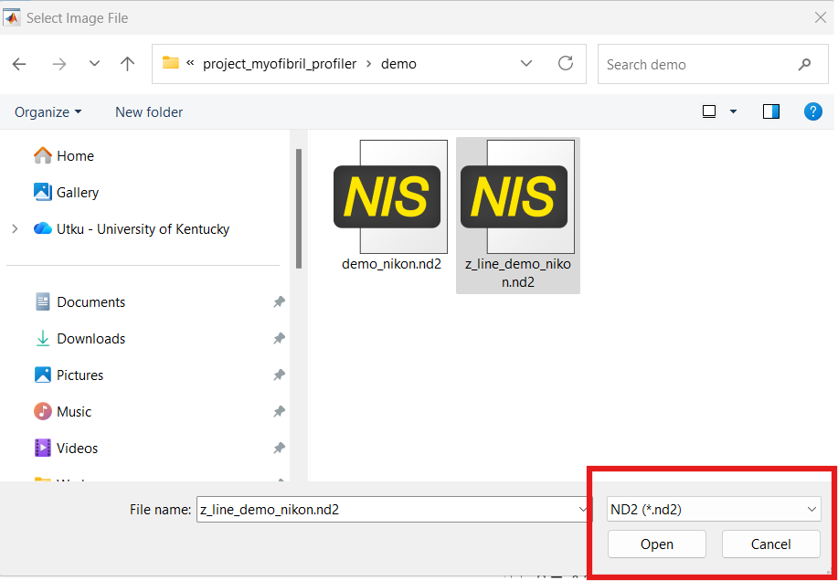</a>

.ND2 files packages data and information from utilized channels under a single file. MyoProfiler directly reads into the files and extract taken images from individual channels, pixels to length scale (um) calibration, and emission wavelengths.

Loaded images appear under the Image Display. The channel tabs are automatically generated. Below image shows the image from the Channel 1, shown in red rectangle.

<a href="media/nikon_image_loaded.png" target="_blank">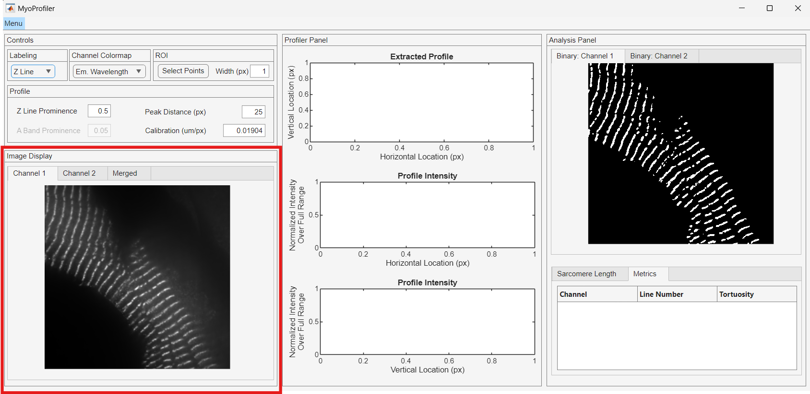</a>

Also, note that the pixels to length scale (micron) calibration is loaded from the loaded file.

<a href="media/nikon_image_calibration.png" target="_blank">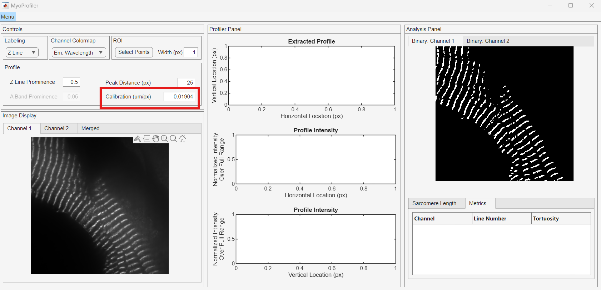</a>

The Z line labeling option uses binarized images to calculate structural metrics, such as tortuosity. The binarized image from the Channel 1 is highlighted below.

<a href="media/nikon_image_channel_1_binary.png" target="_blank">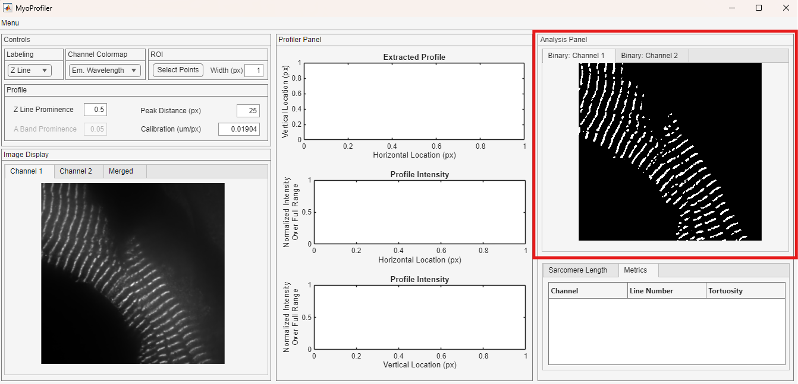</a>

Below image shows the image from the Channel 2, shown in red rectangle.

<a href="media/nikon_image_channel_2.png" target="_blank">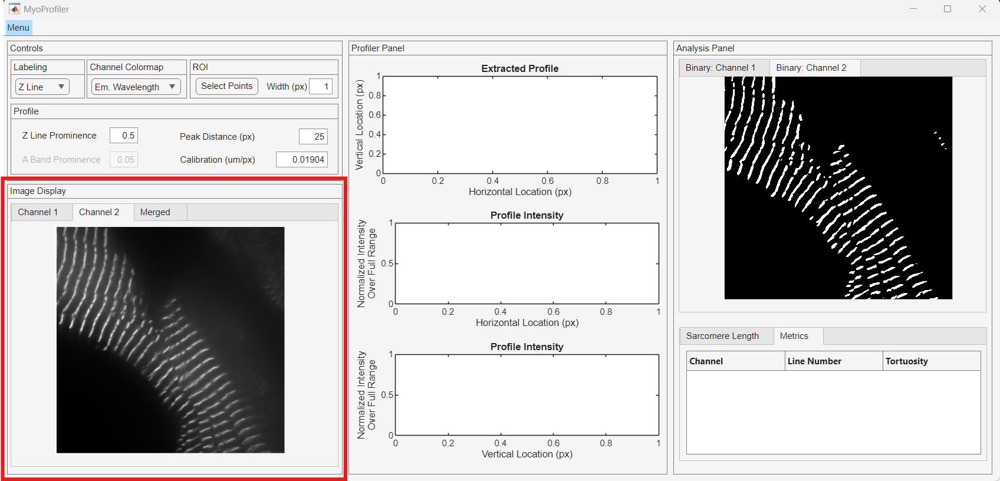</a>

The binarized image from the Channel 2 is highlighted below.

<a href="media/nikon_image_channel_2_binary.png" target="_blank">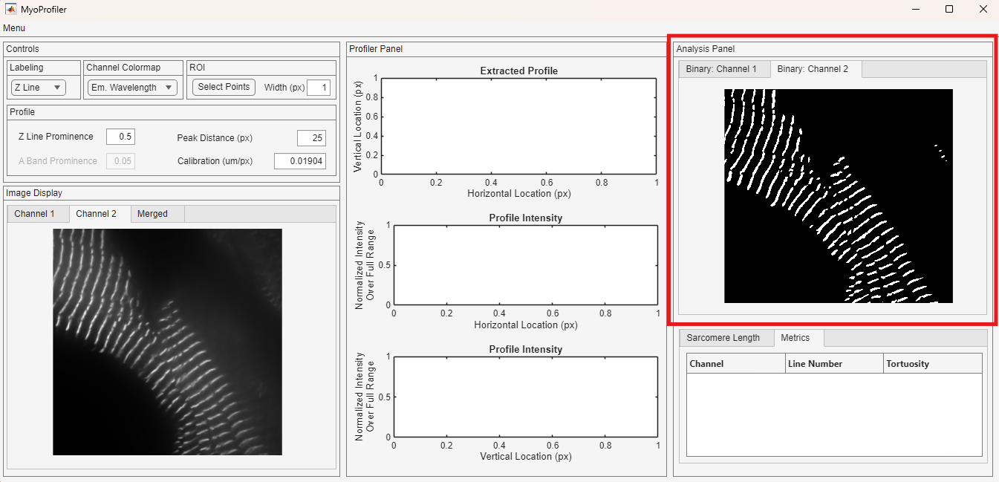</a>

Although the software uses these monochromatic images for analysis, a merged image with pseudo coloring is provided for users to review and qualitative analysis. The pseudo coloring is based on the emitted wavelengths, users can change the coloring using the Channel Colormap dropdown, shown in red rectangle.

<a href="media/nikon_image_merged.png" target="_blank">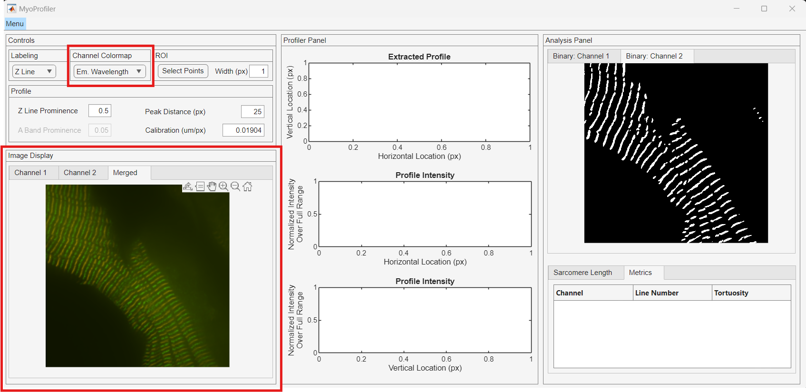</a>

You can hover over the images to reveal the toolbar to Zoom In, Zoom Out, and Reset View. The toolbar is shown in the red rectangle.

<a href="media/image_loaded_image_tools.png" target="_blank">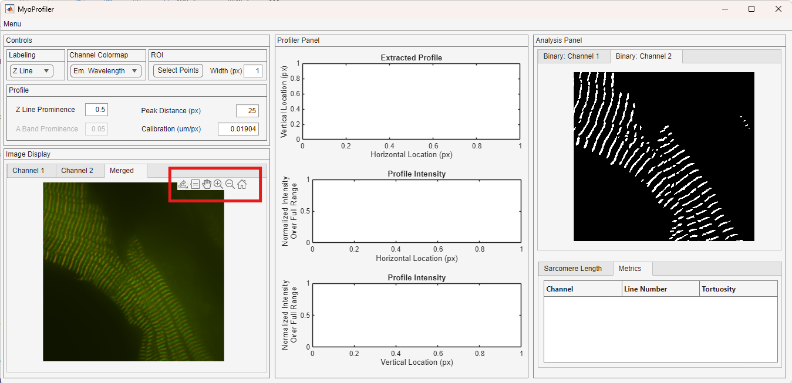</a>

A zoomed in view is useful for qualitative localization and judiciously select ROIs. 

<a href="media/nikon_image_merged_zoom.png" target="_blank">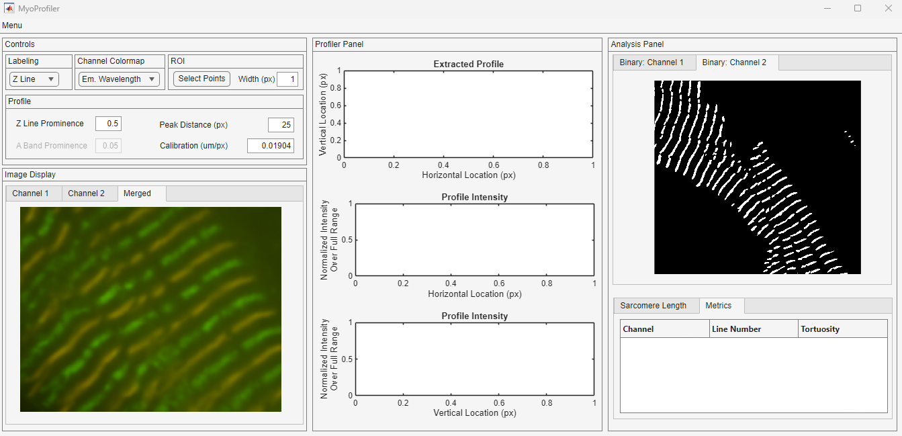</a>

### Loading standard format images

The Load Image option is located under the Menu on the top left corner, shown in the red rectangle. Click on the Menu and access to the dropdown menu.

As you hover over the Load Image option, additional options appear. Click on the Standard Formats option, highlighted in the red rectangle.

Once the Standard Formats option is clicked, the software opens a dialog box, shown below in red rectangle, for users to enter number of channels in their analysis. Although optional, users can provide the emission wavelengths.

<a href="media/standard_formats_channel_input.png" target="_blank">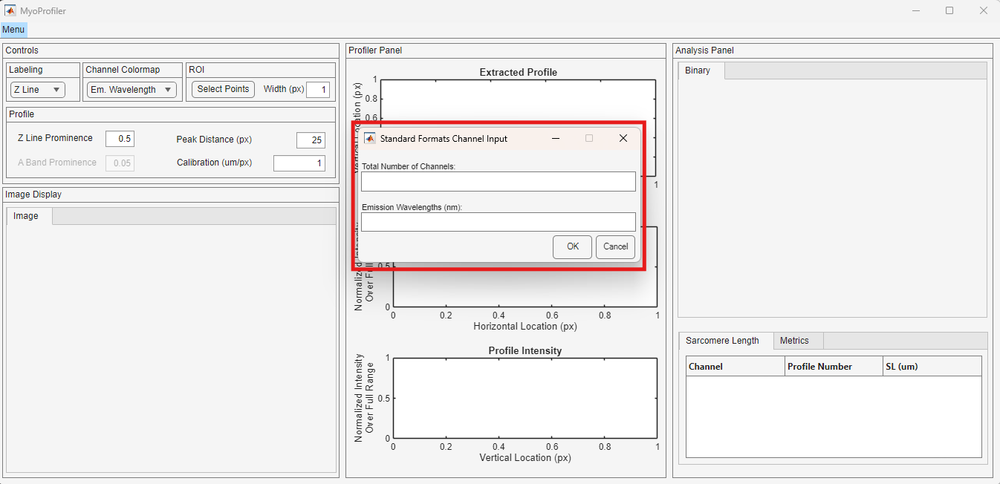</a>

Click OK after the fields are filled out.

<a href="media/standard_formats_channel_input_entered.png" target="_blank">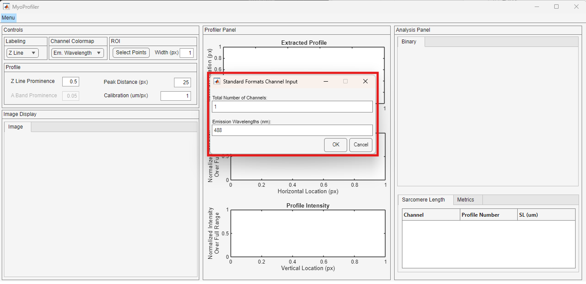</a>

In this tutorial the user provided that there is 1 image with 488 nm emission wavelength. Please note that these image are exported from Nikon example.

MyoProfiler asks for users to load the image for Channel 1. Navigate to your folder with the image files and click Open.

<a href="media/standard_formats_channel_1.png" target="_blank">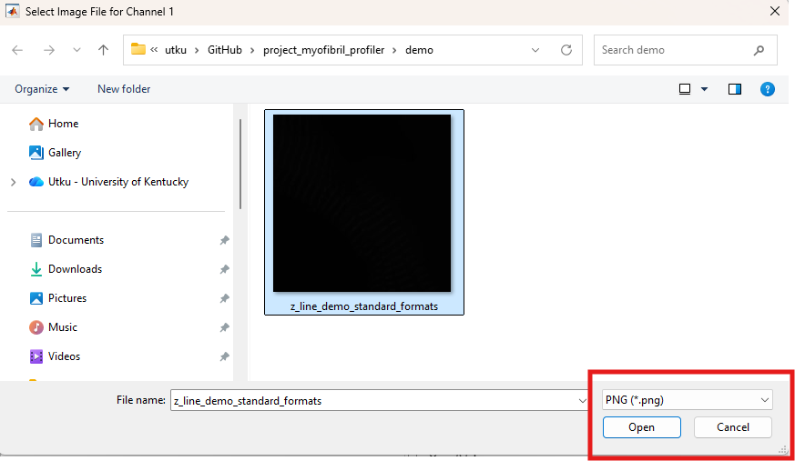</a>

The channel tabs are automatically generated. Below image shows the image from the Channel 1, shown in red rectangle.

<a href="media/standard_images_loaded_channel_1.png" target="_blank">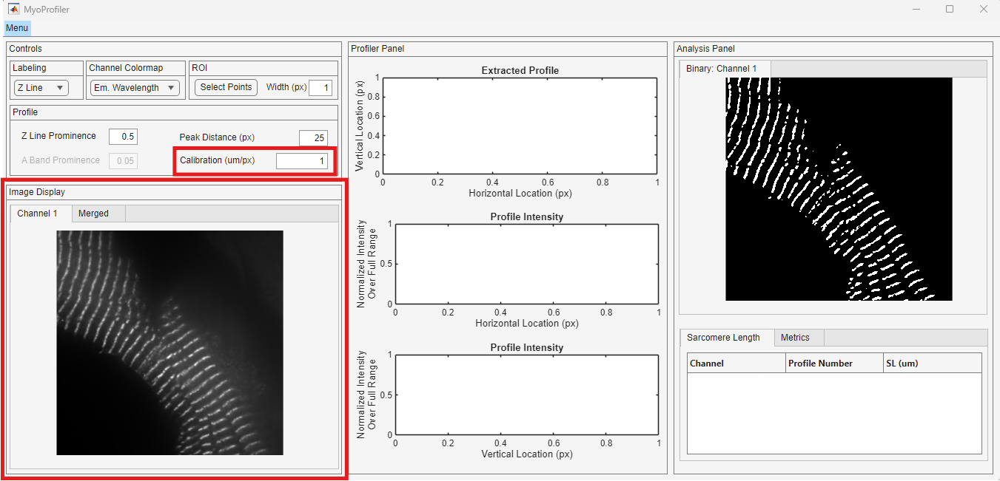</a>

The pseudo colored merged image appears as cyan, instead of green, with respect to the provided wavelengths.

<a href="media/standard_images_loaded_merged.png" target="_blank">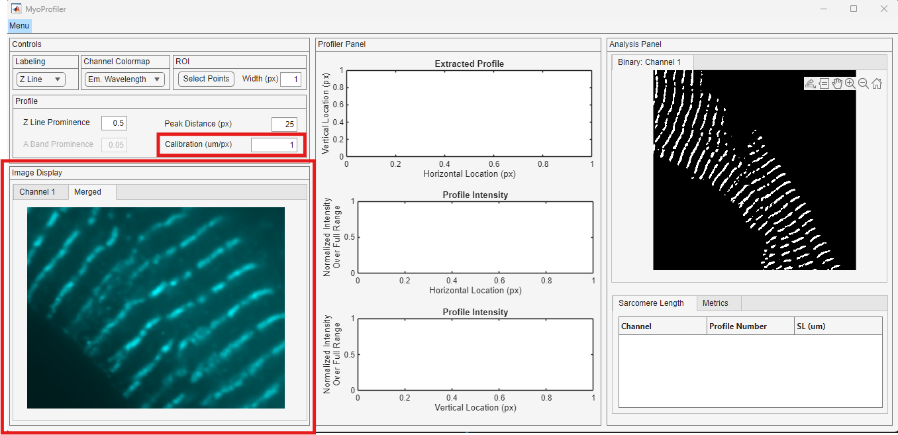</a>

Please note that in the Standard Formats case, users are expected to provide the calibration constant from pixels to microns.

Although the rest of the tutorial uses the loaded standard image, users can get the same results using the Nikon images.

### Region of interests

Now that the image is loaded, users can define their ROI that they want to analyze. Click the Select Points button under the ROI panel shown in the red rectangle.

<a href="media/select_points.png" target="_blank">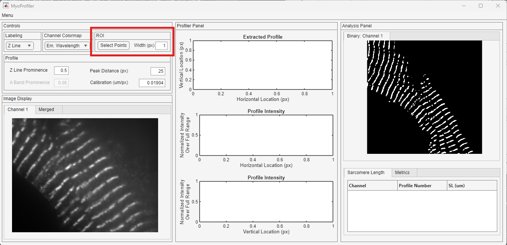</a>

Once clicked the mouse cursor changes to a crosshair for users to pick points. Users can pick as many points as they want as long as the total number of points are greater than 2. These points are connected with a thin blue line on the image axes. Once you are done with the selection, use the right click of your mouse to finalize the process.

<a href="media/select_roi.png" target="_blank">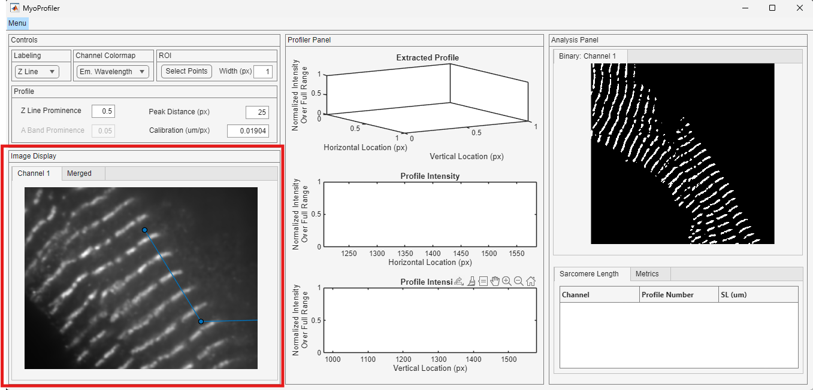</a>

Once the ROI is determined, MyoProfiler defines a spline using the selected points as the controls. The generated spline appears as magenta and in this case it resembles a line as there are only 2 control points. Since all the channels are simultaneously analyzed, software copies the ROI and the splines onto the image and binary channels. Users can define the ROIs in any image channel they prefer.

Here is the ROI and spline in the Channel 1 axis.

<a href="media/select_roi_channel_1.png" target="_blank">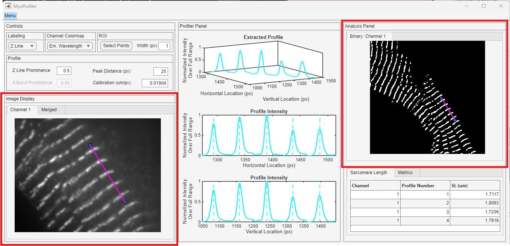</a>

The ROI and spline can be also found in the Merged image axis. Once again, this tab is used for qualitative review.

<a href="media/select_roi_merged.png" target="_blank">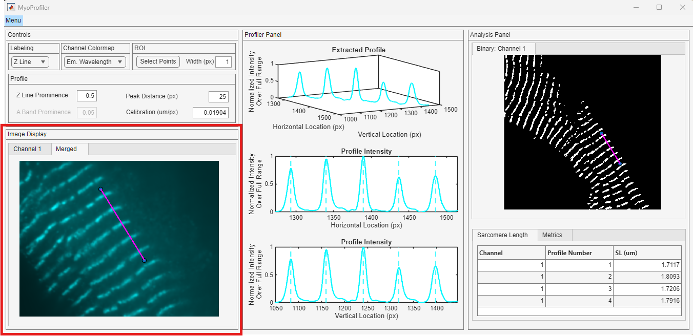</a>

### Profile extraction

<a href="media/extracted_profiles.png" target="_blank">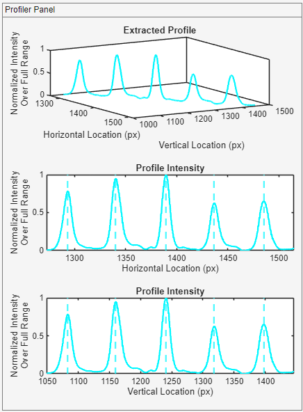{: style="float: left"}</a>

Once the ROIs are defined, the software initiates the analysis. The pixel intensity is extracted along the crosssection of the generated spline. Since the spline is defined in the 2 dimensional space of the horizontal and vertical image axes. Therefore, the extracted profiles are shown in a 3 dimensional axes. The trace colors follow the Channel Colormap scheme. Channel 1 results are shown in green and the Channel 2 results are shown in orange throughout this tutorial.

The extracted profiles are formed by patterns of troughs and crescents and the software uses a peak finding algorithm to identify them. The Z-lines are the starting point and crucial for the rest of the analysis. Since they are probed with a fluorescent agent, they appear as bright in the images with relatively high intensity. The identification is performed on the extracted profile and then locations are marked on respective x and y axes. The Z-lines are shown with dashed lines on the horizontal and vertical image axes figures. Please note that the software specifically aims to capture the peaks with the high intensity in Z line labeling case.

### Sarcomere analysis

<a href="media/sarcomere_panel.png" target="_blank">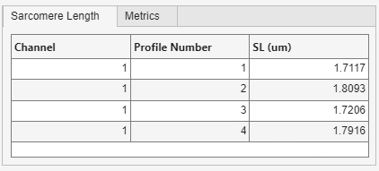{: style="float: left"}</a>

One sarcomere spans between 2 adjacent Z disks. It can be seen from the <a href="/pages/tutorial/start_new_analysis/z_line_analysis.html#profile-extraction">Profiler Panel</a> that there are four full sarcomeres in the extracted profile. The sarcomere length is defined as the distance between 2 Z-lines in 2 dimensional space.The software measures the sarcomere length through an arc length calculation.

### Profiler options

<h5>Channel colormap</h5>

As mentioned earlier, the color scheme follows the emission wavelengths of interest. If the color scheme is not feasible for visualization, users can switch to the Parula colormap. This option is available under the Channel Colormap drop down shown in the red rectangle.

<a href="media/colormaps.png" target="_blank">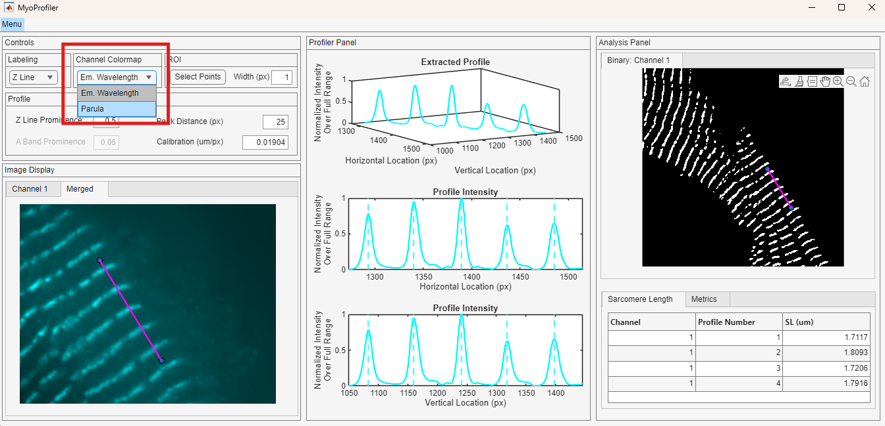</a>

Parula colormap is applied all the traces as well as the pseudo coloring of the merged image.

<a href="media/colormaps_parula.png" target="_blank">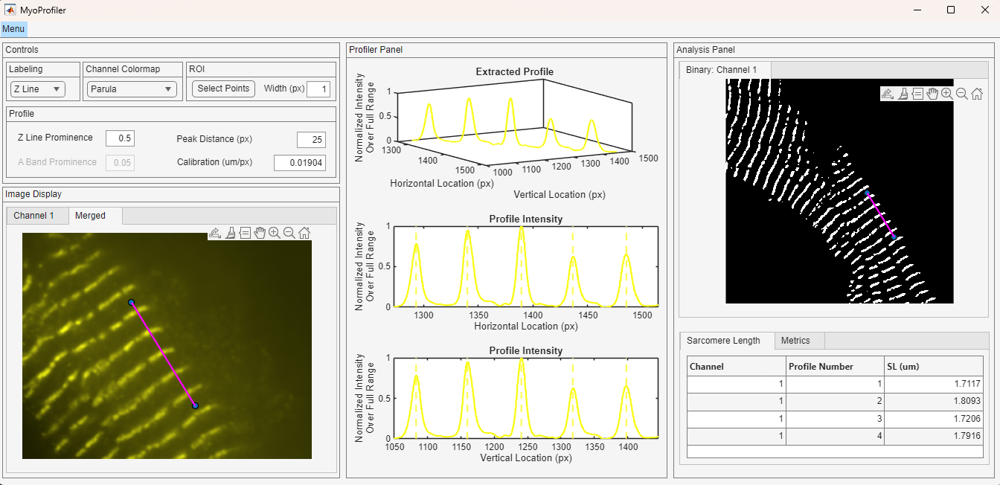</a>

<h5>Pixel to length scale calibration</h5>

The reported sarcomere length are in microns. Users can change the calibration constant from the Calibration field in the Profile Panel, shown in red rectangle.

<a href="media/calibration.png" target="_blank">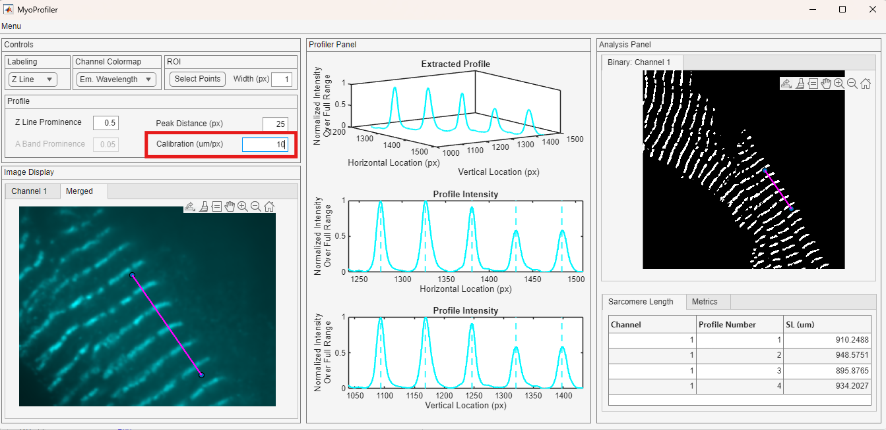</a>

Please not that the only sarcomere length values are changed.

<h5>Z line prominence</h5>

Since the extracted profiles are cyclic, it is important to not to mark all the peaks as the Z-line. The software uses an option called prominence to go around this. The default prominence value is 0.5, which means that MyoProfiler is looking for values that are at least half of the maximum intensity of the sampled space measured from a reference point. Users can change this value through the Profiler panel, shown in red rectangle.

<a href="media/z_line_prominence.png" target="_blank">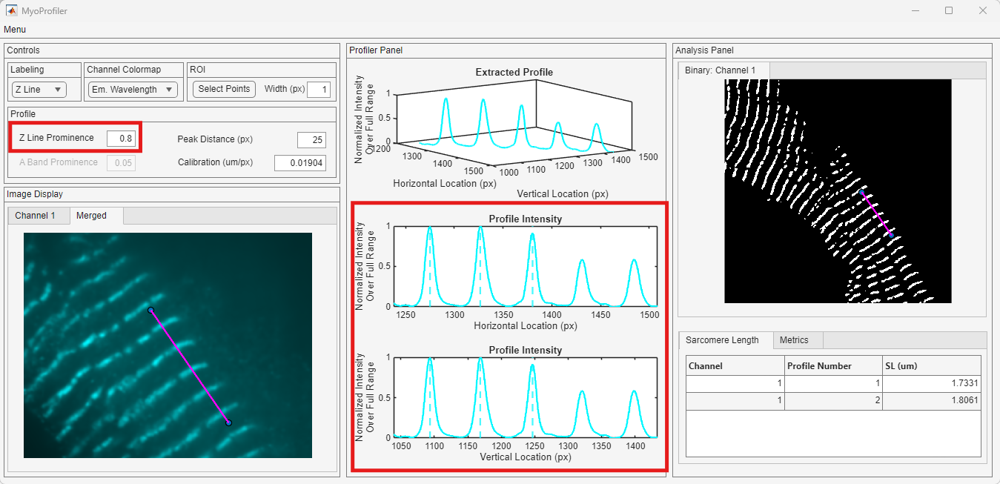</a>

The Z-line prominence value is increased to 0.8 and only three of the peaks are labeled as Z-lines. This option might be useful for troubleshooting purposes, but it resulted in with an unwanted result in this case.

<h5>ROI update</h5>

Each ROI is attached to a callback at the backend to update the calculations once the position is changed. This feature is executed once users are done with repositioning. The blue circles are the anchors of the ROI and can be moved anywhere around the image. Any available anchor point can be used for this purpose. The ROIs and generated splines are updated in all the channels. Users can perform this from any image axis they want. The below video provides and example.

<video src="media/roi_update.mp4" controls="controls" style="max-width: 730px;"></video>

<h5>ROI width (expansion)</h5>

In the above video, the images are analyzed using along a spline. This method is similar to "line scan" in imaging. Users can expand their chosen ROI and transform it to a quadrilateral. In a quadrilateral ROI case, the profiles along the width of the ROI is averaged. The software rotates the image in the backend until the line segment is perpendicular to the vertical image axis, then records the intensity values centered around the spline. This option can be accessed in the ROI panel. Please keep in mind that the width values are entered in pixels. Once the value is changed, a progress window appears to relay progress for each images. This process is robust but please keep in mind that the length of this process depends on the length of the ROI. The below video shows an example in real time on a standard laptop.

<video src="media/roi_expansion.mp4" controls="controls" style="max-width: 730px;"></video>

### Structural metrics

<a href="media/metrics_panel.png" target="_blank">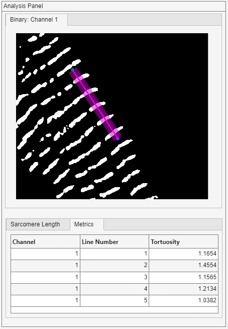{: style="float: left"}</a>

The software determines the "straightness" of the Z lines using a metric called tortuosity. Tortuosity is the ratio of the effective length of stripes to distance between its endpoints.

$`Tortuosity= \frac{\text{Actual path length}}{\text{Distance between endpoints}}`$

Tortuosity calculation requires a quadrilateral ROI and would not be quantified for "line scan" ROIs. Each image is automatically binarized as soon as they are loaded into the interface. Once the user selects their ROI, software picks the region of interest and <a href = "https://www.mathworks.com/help/images/ref/bwskel.html">skeletonize</a> binary elements to lines. While the distance between endpoints determined as the "straight line" distance between two points in two dimensional space, the actual path length is calculated as the summation of pixel to pixel distance along the each line.

### Export results

Once users are done with their analysis, they can export the analysis into their host computers. A summary Excel sheet and an analysis file with .myoprof extension are saved. The exported analysis files can be loaded back into the software to [revisit the analysis](../load_analysis/load_analysis.html).

Export Analysis option is accessed through the top menu, shown in the red rectangle.

<a href="media/export_analysis.png" target="_blank">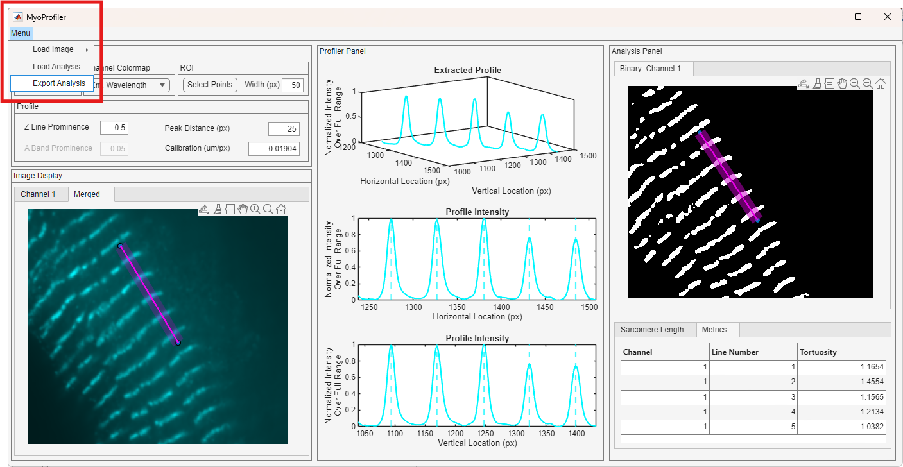</a>

Once it is clicked, it opens a file dialog. Navigate to the folder that you want to use.

<a href="media/export_analysis_dialog.png" target="_blank">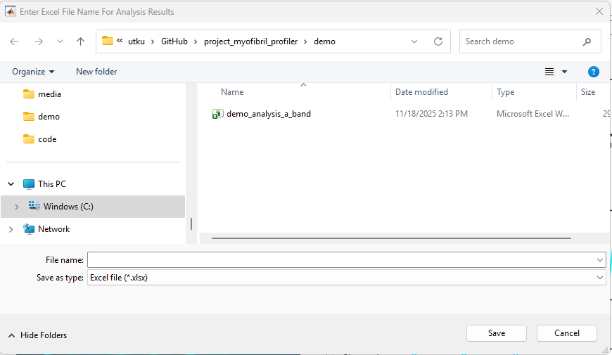</a>

The Excel file and the .myoprof file share the same name. Enter the name and hit Save. You can find both of the files under the designated folder.

<a href="media/saved_files.png" target="_blank">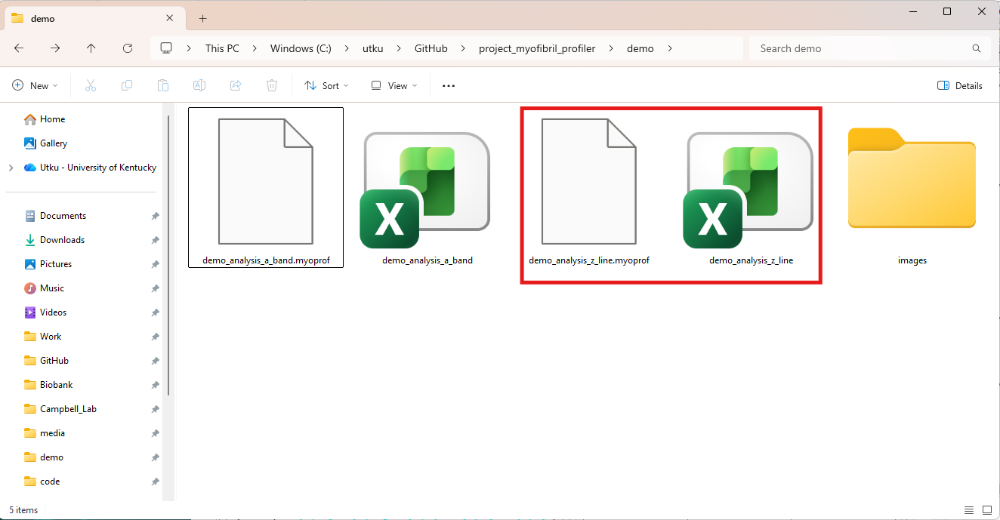</a>

The exported Excel file has multiple sheets. The first sheet is the Analysis Summary sheet. It consists of the name of the analyzed image, used calibration, and number of channels. The summary stats for sarcomere length and tortuosity are given with mean, standard deviation, and standard error of the mean.

<a href="media/analysis_summary.png" target="_blank">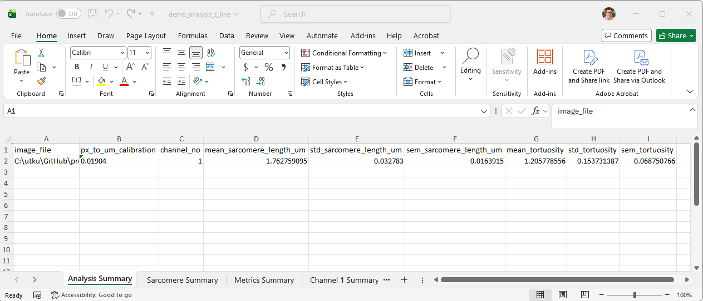</a>

The second sheet is the Sarcomere Summary. It is the exported version of the sarcomere table in the Analysis Panel. You can find the individual values from each sarcomere here.

<a href="media/sarcomere_summary.png" target="_blank">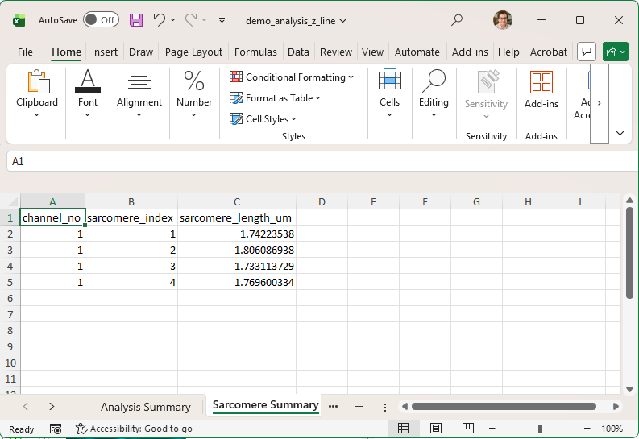</a>

The third sheet is the Metrics Summary. It is the exported version of the metrics table in the Analysis Panel. You can find the individual values from each Z line here.

<a href="media/metrics_summary.png" target="_blank">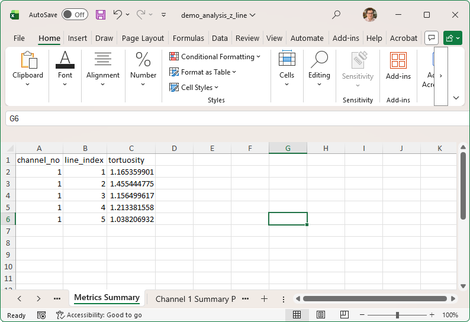</a>

The following sheets are available for all the analyzed channels. Summary profiles sheet stores the mean, standard deviation, and standard error of the mean intensity profiles extracted from two adjacent Z lines.

<a href="media/channel_1_summary_profiles.png" target="_blank">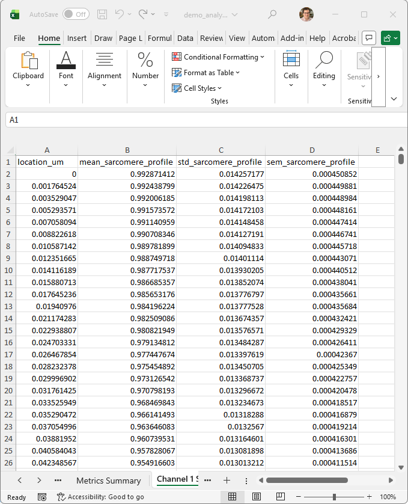</a>

The Sarcomere Profiles has the individual intensity profiles of extracted profile.

<a href="media/channel_1_sarcomere_profiles.png" target="_blank">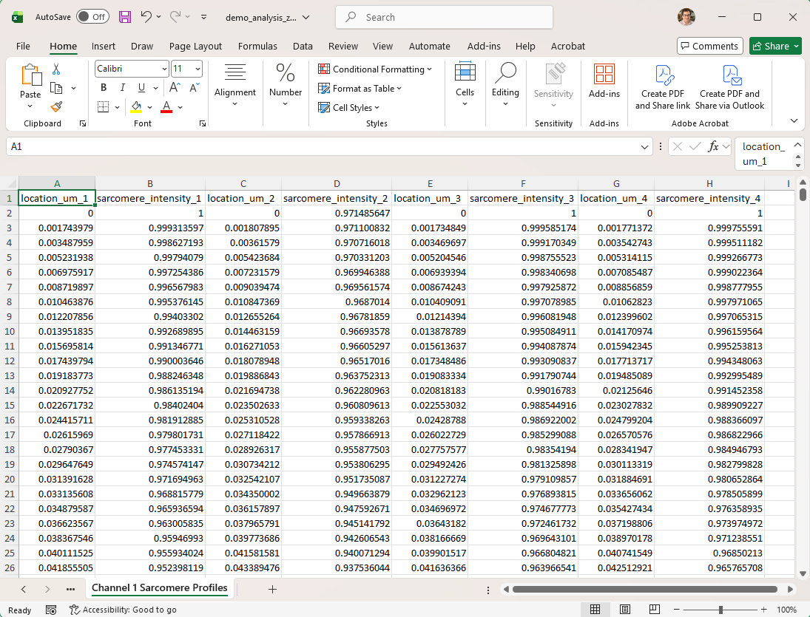</a>

